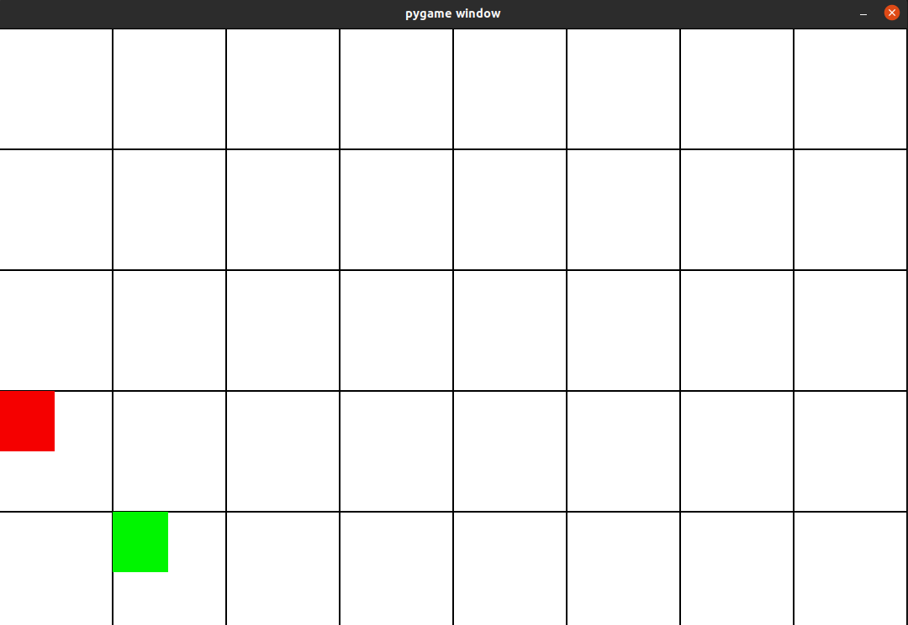

# Grid-Q-Learner
Q-Learning application that seeks to find the best path to a goal across a randomly defined grid.

Resulting application can be configured for both the Environment and Agent using CSV and YAML filetypes.  Also contains a GUI option to visualize what the agent is doing in the environment.  The red box is the agent and the green box is the desired tile reward.

## Lessons Learned

1. Ensure that when updating the Q-Table, the rewards for state changes are set correctly so that one side of the table isn't favored over the other.  This leads to the agent consistently choosing those states, resulting in entrapment within local minima/maxima.
2. ALWAYS ensure that the reward for reaching the desired state is accounted for in the Q-Table.  I failed to do this and did not realize it until much later.